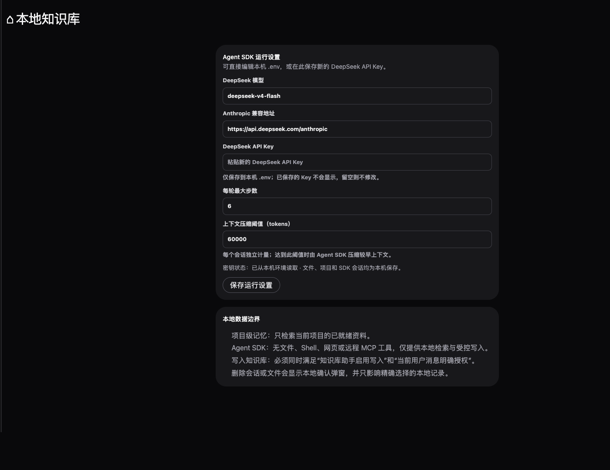

# Knowledge Helper / 本地知识库问答助手

[中文](#中文) · [English](#english)

本机运行的多模态知识库问答助手。它使用 FastAPI、React/HeroUI，以及官方 `@anthropic-ai/claude-agent-sdk`；模型推理由你配置的 DeepSeek Anthropic 兼容接口提供。

A local multimodal knowledge-base Q&A assistant built with FastAPI, React/HeroUI, and the official `@anthropic-ai/claude-agent-sdk`. Model inference is provided through your configured DeepSeek Anthropic-compatible endpoint.

## 中文

### 功能

- 多轮问答、历史会话加载/搜索/重命名/置顶/分支/导出/删除，以及每个会话独立的上下文用量与压缩进度。
- 本地上传与扫描 PDF、图片、Markdown、TXT 等资料；PDF 支持文本提取、页码记录和预览，图片支持缩略图与原文件返回。
- 基于中文字符 n-gram + TF-IDF 的本地检索；回答显示命中的来源文件、预览或下载入口。
- 使用 Claude Agent SDK 驱动的本地 MCP 工具：只读 `search_knowledge`，以及用户在当前消息明确授权时才可用的 `save_knowledge_note`。
- SSE 流式输出、可核对的工具调用/检索/压缩执行记录，以及中断生成。
- 页面可配置切片、重叠、PDF 范围、Top-K、上下文压缩阈值、DeepSeek 模型与本地 embedding/reranker 预留项。

> 当前真正执行的是本地关键词 TF-IDF 检索。embedding 与 reranker 的页面配置会保存和校验，但尚未接入向量检索执行器。

### 界面截图

| 新建对话 | 本机运行设置 |
| --- | --- |
|  |  |

截图来自本机服务的独立临时浏览器会话；不包含知识库文件、历史对话或 API Key。

### 快速开始

准备 Python 3.11+、Node.js 18+（本项目以 Node.js 22 验证）以及可用的 DeepSeek API Key。HeroUI Pro 依赖需要由每位使用者按其自身授权安装；本仓库不保存该授权密钥。

```bash
git clone https://github.com/sleepdecidehair/knowledge-helper.git
cd knowledge-helper

python3 -m venv .venv
source .venv/bin/activate
pip install -r requirements.txt
cp .env.example .env

(cd agent_sdk && npm ci && npm run build)
(cd frontend && npm ci && npm run build)

uvicorn app.main:app --reload --port 8000
```

编辑本机 `.env`，填入 `DEEPSEEK_API_KEY`；也可以在页面“设置”中提交新 Key。服务只会写入本机 `.env`，读取设置接口不会回显既有 Key。随后打开 <http://127.0.0.1:8000>。

默认兼容地址为 `https://api.deepseek.com/anthropic`，模型为 `deepseek-v4-flash`；请按自己的 DeepSeek 账号可用模型调整。详细环境变量见安全示例文件 [`.env.example`](.env.example)。

### 使用方式

1. 在对话框点击附件图标上传资料，或把文件放进本机 `knowledge/` 后从页面扫描重建。
2. 在当前项目内提出问题。Agent 必须先调用本机知识检索，缺乏依据时会拒绝编造答案。
3. 要创建笔记时，在当前消息清晰说明意图，例如：

   ```text
   请把以下内容写入知识库，标题是「差旅住宿标准」：
   国内出差住宿标准为每晚 500 元，超出部分需部门负责人审批。
   ```

一次请求最多创建一份新的 Markdown 笔记；模型不能自行选择路径、覆盖或删除本地知识。

### 数据与安全边界

- 原文件、索引、预览、项目、浏览器可见消息和 SDK 会话转录保存在本机 `knowledge/` 与 `data/`，并已由 `.gitignore` 排除。
- 本项目不是完全离线模型：每次调用会把当前问题、该会话保留的上下文，以及检索命中的有限文本发送到 DeepSeek；未命中的本地文件不会被整份上传给模型。
- 本项目没有登录、多用户权限或企业审计，不适合直接用于受监管或高敏感数据的生产场景。
- 绝不要提交 `.env`、`data/`、`knowledge/` 或真实 API Key。发现漏洞请按 [SECURITY.md](SECURITY.md) 私下报告。

### 开发与验证

```bash
.venv/bin/pytest -q
(cd frontend && node --test tests/*.test.mjs && npm run lint && npm run build)
(cd agent_sdk && npm run check)
```

接口概览：`/api/upload` 处理上传，`/api/index/rebuild` 扫描本地知识库，`/api/chat/stream` 提供 SSE 对话，`/api/conversations` 管理会话，`/api/workspace-settings` 保存本机运行设置。功能范围与后续优先级见[功能点清单](docs/知识库问答智能体功能点清单.md)。

## English

### Features

- Multi-turn chat with local history: load, search, rename, pin, branch, export, and delete conversations. Each conversation has its own context-use and compaction progress.
- Local ingestion for PDFs, images, Markdown, TXT, and similar files. PDFs are text-extracted with page references and previews; images have thumbnails and original-file links.
- Local Chinese character n-gram + TF-IDF retrieval with cited source files, previews, and downloads.
- Local MCP tools driven by Claude Agent SDK: read-only `search_knowledge`, plus `save_knowledge_note` only when the current user message explicitly authorizes a write.
- SSE streaming, inspectable tool/retrieval/compaction events, and generation interruption.
- UI settings for chunking, overlap, PDF scope, Top-K, compaction threshold, DeepSeek settings, and reserved local embedding/reranker settings.

> The active retriever is local keyword TF-IDF. Embedding and reranker settings are persisted and validated, but a vector retrieval executor is not implemented yet.

### Screenshots

| New conversation | Local runtime settings |
| --- | --- |
|  |  |

These screenshots are captured from an isolated temporary browser profile against the local service. They contain no knowledge-base files, chat history, or API key.

### Quick start

Install Python 3.11+, Node.js 18+ (validated with Node.js 22), and obtain a DeepSeek API key. Each user must install HeroUI Pro dependencies using their own license; no license key is stored in this repository.

```bash
git clone https://github.com/sleepdecidehair/knowledge-helper.git
cd knowledge-helper

python3 -m venv .venv
source .venv/bin/activate
pip install -r requirements.txt
cp .env.example .env

(cd agent_sdk && npm ci && npm run build)
(cd frontend && npm ci && npm run build)

uvicorn app.main:app --reload --port 8000
```

Set `DEEPSEEK_API_KEY` in your local `.env`, or submit a new key from **Settings** in the UI. The service writes it only to local `.env`; read APIs never return an existing key. Open <http://127.0.0.1:8000> afterward.

The default endpoint is `https://api.deepseek.com/anthropic` and the default model is `deepseek-v4-flash`. Change them to a model available to your DeepSeek account. See the safe template in [`.env.example`](.env.example).

### How to use it

1. Upload files with the attachment icon, or place them in local `knowledge/` and trigger a scan/rebuild in the UI.
2. Ask questions within the active project. The Agent is required to search the local knowledge base and refuses unsupported answers.
3. To create a note, state the intent clearly in the current message, for example:

   ```text
   Save the following to the knowledge base with the title "Travel lodging policy":
   Domestic lodging is capped at CNY 500 per night; exceptions require manager approval.
   ```

At most one new Markdown note is created per request. The model cannot pick arbitrary local paths, overwrite files, or delete knowledge.

### Data and security boundary

- Original files, indexes, previews, projects, browser-visible messages, and SDK session transcripts are stored in local `knowledge/` and `data/`; both are ignored by Git.
- This is not a fully offline model. Each inference sends the current question, retained context for that conversation, and limited retrieved excerpts to DeepSeek. Files that are not retrieved are not sent in full.
- This prototype has no authentication, multi-user access control, or enterprise audit trail. Do not use it directly for regulated or highly sensitive production data.
- Never commit `.env`, `data/`, `knowledge/`, or a real API key. Report security issues privately as described in [SECURITY.md](SECURITY.md).

### Development and verification

```bash
.venv/bin/pytest -q
(cd frontend && node --test tests/*.test.mjs && npm run lint && npm run build)
(cd agent_sdk && npm run check)
```

API overview: `/api/upload` ingests files, `/api/index/rebuild` scans local knowledge, `/api/chat/stream` provides SSE chat, `/api/conversations` manages conversations, and `/api/workspace-settings` stores local runtime settings. See the [feature inventory](docs/知识库问答智能体功能点清单.md) for the detailed scope and roadmap.

## License / 许可证

Distributed under the [MIT License](LICENSE).

本项目以 [MIT License](LICENSE) 发布。
